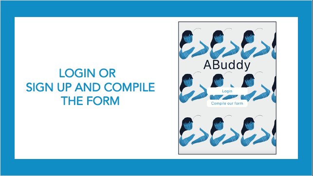
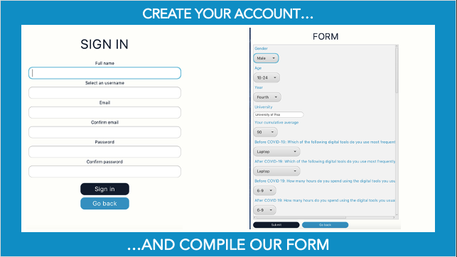
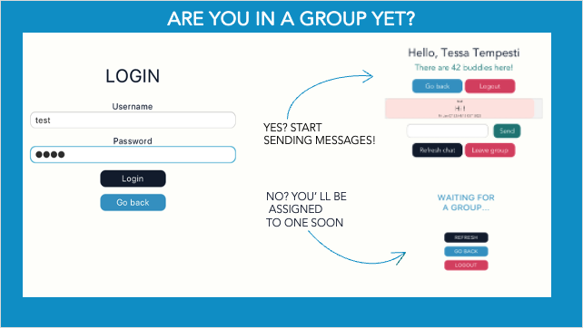
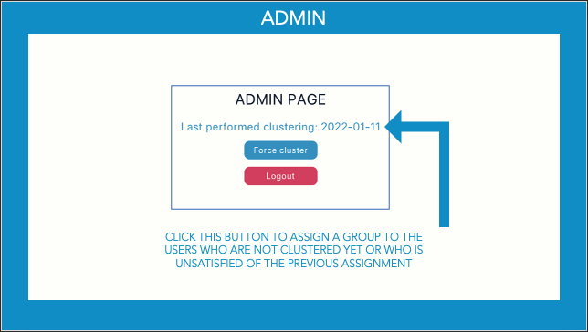

# ABuddy
Data Mining and Machine Learning project developed by Pietro Tempesti and Benedetta Tessa
## The application

### What is ABuddy?
Worsening mental health has become an increasingly concerning issue during the pandemic, but recent studies have shown that peer-to-peer support has been nothing but beneficial to young students.

What we aim to do is connect people so that they build a relationship based on empathy which may lead to a mutual mental health improvement.
We want to cluster individuals based on the answer of a quick survey so that their similar experiences may help build trust and feeling more comfortable with each other.

### How does ABuddy work?

## Repository organization
The application is composed by one module, which implements the user interface, the logical behaviours, the database collections and the ML tasks.
In addition, there's a MySQL dump with a demonstration database.
## How to install and run the application
First of all, you need to import the database on MySQL using the *abuddy_dump_final.sql* script.

Load the repository into an IDE such as IntelliJ and run the HelloApplication class.

Now you can sign up and compile the form, waiting for a clustering operation.
To force the clustering operation you can login as an administrator (user: admin, password: admin) and press the button "Force clustering".
The uploaded dump contains only users already clustered as a demonstration purpose, so if you want to explore the application you can login with the test account (user: test, password: test)
